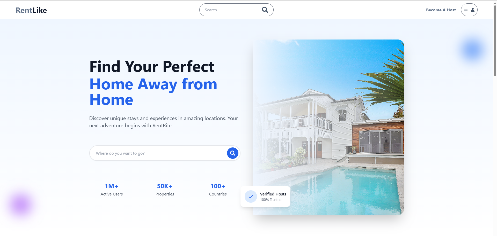

# RentLike - Property Rental Platform

A full-stack property rental platform built with React, Node.js, and MongoDB.



## Features

- User authentication (Login/Register)
- Property listing creation and management
- Property search and filtering
- Wishlist functionality
- Booking system
- User profile management
- Responsive design

## Tech Stack

### Frontend
- React
- Redux Toolkit
- React Router
- Tailwind CSS
- React Icons

### Backend
- Node.js
- Express
- MongoDB
- JWT Authentication
- Multer for file uploads

## Getting Started

1. Clone the repository
```bash
git clone https://github.com/ahmedmohamed161999/Rentals-Platform.git
```

2. Install dependencies for both frontend and backend
```bash
# Install backend dependencies
cd backend
npm install

# Install frontend dependencies
cd ../frontend
npm install
```

3. Set up environment variables
Create a `.env` file in the backend directory with:
```
MONGO_URI=your_mongodb_connection_string
JWT_SECRET=your_jwt_secret
```

4. Run the application
```bash
# Run backend (from backend directory)
npm run dev

# Run frontend (from frontend directory)
npm run dev
```

## Contributing
Pull requests are welcome. For major changes, please open an issue first to discuss what you would like to change.

## License
[MIT](https://choosealicense.com/licenses/mit/)